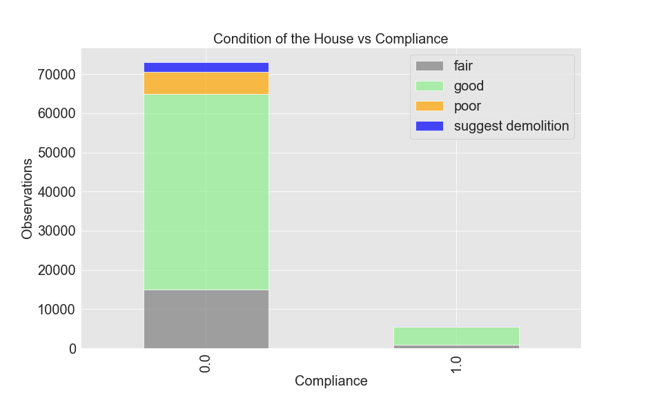
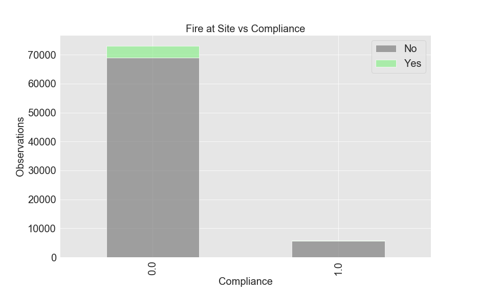

# Understanding and Predicting Blight Fine

## Overview

Blight violations are issued by the city to individuals who allow their properties to remain in a deteriorated condition. 
Blight has become a serious problem in Detroit. Every year the city issues millions of dollars in fines to violators 
and every year many of those tickets go unpaid. Following up and enforcing these fines can become extremely costly as well
and as such they want to use predictive analytics to increase ticket compliance.

## Business Problem
For this project we wanted to better predict when someone in Detroit would not
only allow their property to fall to blight but also not be compliant with the 
fines issued afterwards.

We based this project on a data challange from the Michigan Data Science Team (MDST) 
and the MIchigan Student Symposium for Interdisciplinary Statistical Sciences (MSSISS). 
They partnered with the City Detroit to better understand this problem.

To answer this question we first needed to understand when and why a resident would not 
comply with a blight violation. This is the task, understanding the factors that play 
into that, be they categorical or numerical.

Data for this project was uploaded from City of Detroit Open Data Portal - https://data.detroitmi.gov/datasets/blight-violations

## Approach

General Approach for this problem was based on Cross Industry Standard Process for Data Mining (CRISP-DM)
Which includes all following pmpotrtant steps: 

1. Look at the big picture. 
2. Get the data. 
3. Discover and visualize the data to gain insights. 
4. Prepare the data for Machine Learning algorithms. 
5. Select a model and train it. 
6. Fine-tune your model. 
7. Present your solution. 
8. Launch, monitor, and maintain your system.

## Methodology

1. Data cleaning and preparation. Narrow down datasets to include important features.
2. Merging data sets along usefull columns and synthesize a more useable dataset with features.
3. Visualization variables based on different categories.
4. Identify Apropriate Evaluation metrics for model.
5. Generate classification models and evaluate results.
8. Generalize final model. Perform tunning. 

## Analysis

For this project we started with very large data sets, so the first step was stripping down what we thought would be usefull 
and combining it all into one dataset. This is primarilly what the ingeniring notebook was used for. We also used this notebook 
to do some feature engineering with the crime_count. Target variable was define as compliance and non-compliance forthe blight ticket.
Following visualisations help us understand more data.

As we can see based on some criterias from conditions of the building we can make  assumptions about target variable. In this case building with sugested demolition most likely will get to non-compliance class. Same we can say about building with condition - "poor"

Chart above proof that all buildings that had fire at site associated with non-complience tickets.

## Modeling

Using Scikit-learn and IMBlearn packages 6 classification models were created :
- Logistic Regression. 
- Logistic Regression with SMOTE.
- Decision Tree.
- Decision Tree with SMOTE.
- Random Forest.
- Decision Tree with GridSearchCV.
- AdaBoost and Gradient Boosting with Weak Learners.

## Results

Prcision and F1 Score was choosen as Metrics for Evaluation of model.
Based on a buisness problem, Precision would allow us to be certain and correctly allocate revenue with flase negatives giving us an upper bound on the budget. 
After evaluating Logistic Regression Model and Decsission Tree Vanilla models we were still getting low scores . 
But Randome Fores showed prety high results with Pressision = 89% and weighted avg f1-score = 93%
Following graph shows Feature Importance generated with Random Forest Model.

As we can tell 'judgment amount', 'crime_count' and 'desposition' end up to be most importent features.
The next step was to try models based on Boosting Algorithms. Ada Boost didn't show beyter results but Gradient Boostin Clasifier gave the best scores. 
After perfoming Grid Search we were able to get best parameters for highest precision and weighted avg f-1 score.

It was determined that the Random Forest model perfromed the best and was utilized for the final implementation. 

## Conclusion
The synthesized data was analyzed and modeled. Some of the significant factors in determining if someone was going to pay on time were Judgement amount, crime count, disposition, and the condition of the lot. Applying the Scikit-learn Models we were able to get a precision score of 91%. The feature that had the most impact was judgement amount

## Future Work
Expand the Model to Predict Multi-class Target (Include people who didn't pay on time but still paid.)
Bring More Data into Model from Outside Resources for Feature Engineering. 

## Repository Structure

    ├── README.md                    # The top-level README for reviewers of this project",
    ├── data                         # Synergized Data obtained from University of Michigan and Detroit Open Data Portal",
    ├── modules                      # py files with functions for ingeniring and modeling",
    ├── images                       # Both sourced externally and generated from Code",       
    ├── modeling.ipynb               # Notebook that gpes pver out modling process",                                        
    └── features_ingeniring.ipynb    # Notebook Used for feature engineering before Modeling",
    
    
**Authors**  
[Ivan Vanko](https://github.com/vanitoz) 
[Kelvin Arellano](https://github.com/Kelvin-Arellano) 
